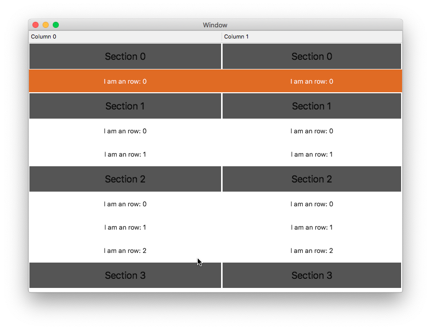

# VNTableView

[](https://travis-ci.com/hechen/VNTableView)        

Subclass of NSTableView, which support multiple sections like UITableView.





### API

#### VNTableViewDelegate

``` Swift
    func tableView(_ tableView: VNTableView, heightOfRow row: Int, section: Int) -> CGFloat
    func tableView(_ tableView: VNTableView, viewForRow row: Int, section: Int, tableColumn: NSTableColumn?) -> NSView?
    func tableView(_ tableView: VNTableView, heightOfSection section: Int) -> CGFloat
    func tableView(_ tableView: VNTableView, viewForSection section: Int, tableColumn: NSTableColumn?) -> NSView?
```

#### VNTableViewDataSource

``` Swift
    func numberOfSections(in tableView: VNTableView) -> Int
    func numberOfRows(in tableView: VNTableView, section: Int) -> Int
```
